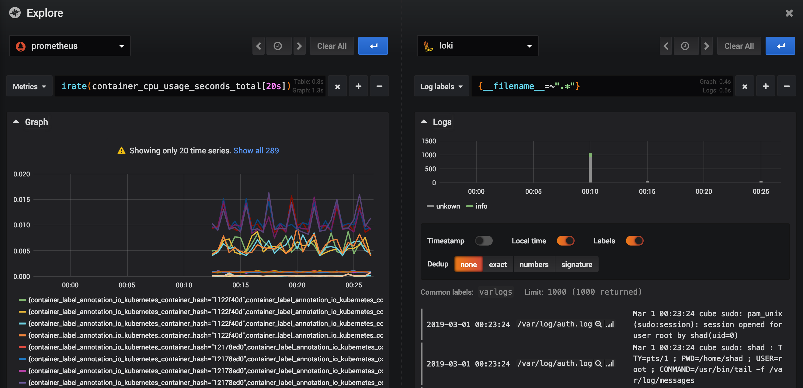

# About

Simple playground to try together combination of awesome tools: Grafana 6 + Loki + Prometheus.

# Start & Stop

```bash
# Start
git clone https://github.com/shadinua/demo-grafana-loki-prometheus
cd demo-grafana-loki-prometheus
docker-compose up

# Stop
^C
docker-compose down
```

<p align="center"></p>

# Components

This playground contains:
* `loki` - storage for logs
* `promtail` that scrapes logs from your `/var/log` directory and puts to `loki`
* `cadvisor` - exports metrics of running docker containers
* `prometheus` - storage for metrics, get metrics from `cadvisor`, interface: [http://localhost:9090](http://localhost:9090)
* `grafana` with pre-configured both datasources — `loki` and `prometheus`, interface: [http://localhost:3000](http://localhost:3000), `admin`/`test`

# What to play?

* new `explore` panel: fast search for data, debug, easily play without creating complex dashboards
* split screen: nice mode, where you can simultaneously see, for example, `prometheus` metrics at the left panel and `loki` logs on the right
* queries to `prometheus`:
  - `irate(container_cpu_system_seconds_total[20s])`
  - `container_memory_rss`
  - ...
* queries to `loki`
  - `{job="varlogs"}`
  - `{__filename__="/var/log/syslog"}`
  - ...
* create dashboards
* ... many many more ...
